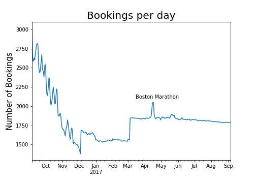
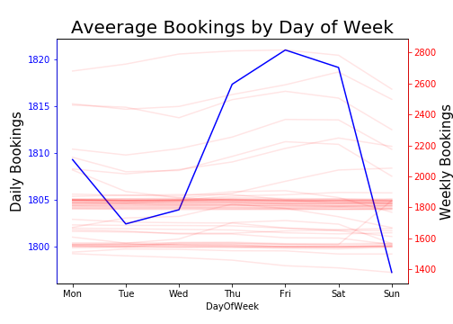
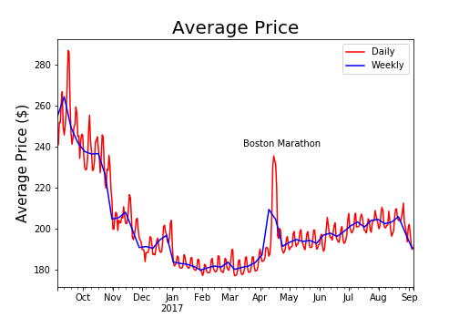
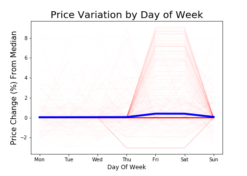
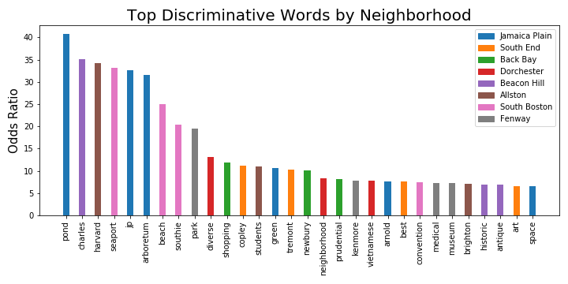

# Finding patterns in AirBnB postings: A Boston Case Study

AirBnBs have been growing in popularity across the world ranging from a small room in an apartment to large beach side mansions. Renting an AirBnB is a simple process; log onto the website, find a place, and then book!

Of course, we all know that finding a place is not that easy. Once you narrow down the location and time, you still need to find an AirBnB that has the right number of rooms, close to points of interest, and many other amenities. Besides looking at reviews, the actual post also plays a big role in the attractiveness of a unit. In this analysis, I explore some commonalities of AirBnBs, focused in Boston. 

# Boston AirBnB Data

The data for this analysis was downloaded from [Kaggle](https://www.kaggle.com/airbnb/boston). There are a total of three files. 

`calender.csv` contains around 1.3 million availabilities of 3585 listings from Septembber 6 2016 to September 5 2017. A flag indicates if the listing was booked for a given day. There is also the price for AirBnBs that were not booked.

`listings.csv` contains data for each of the 3585 listings such as host information, listing description, and review score.

`reviews.csv` contains arouund 68 thousand reviews for the same listings. This data includes the date of the review but **not** the booking date.

# What are the patterns in booking times?

The above plot shows the number of bookings in Boston over time. The first thing to notice is that there is a large drop in bookings from October 2016 to Jan 2017. While it is tempting to say this is due to the effects of winter, this is impossible to confirrm without more longitudinal data. This is especially evident from March onwards since there is no increase in bookings during the summer months.

As a side note, the Boston Marathon shows how large of an effect a single event can have in the number of bookings. The day of the marathon had 12% more bookings than the previous. 

## Weekly Patterns

I typically book AirBnBs for vacation reasons. This typically occurs Friday and Saturday night and is probably true for a majority of people. In order to test this, I look at booking rates across each day of the week (Mon - Sun).

The blue line indicates the average number of bookings across all 3585 listings. As expected, Friday and Saturday were the highest followed by Thursday. The standard workdays showed lower rates of booking. The individual listings shown in red tell a slightly different story. Most listings seem to have the same number of bookings regardless of the day of the week. The remaining minority, on the other hand, vary greatly.

# What are the patterns in pricing?

Similar to the booking patterns, the price greatly decreased from October to January and then slowly increased for the rest of the time period. The prices during the Boston Marathon sharply increased, mostly likely due to the high demand. The oscillations in the daily price tell us that the pricing is somewhat dependent on the day of the week.

## Weekly Patterns

In order to study the daily price changes, I calculated the percentage difference between the mean price per day of the week and the total median price. After removing the outliers, the plot below shows a slight (1%) increase during the peak times. 

When looking at individual listings, most increased in price over the weekend. But the low overall increase suggests that a majority of listings have a constant price regardless of the day of the.

# What words are used to describe the different neighborhoods in Boston?

When I look for AirBnBs, the specific location is very important to me. Not only do I want to be close to my points of interest, but I also want to explore what's around the area. Using the description from each listing, I isolate words that are important and unique to each neighborhood in Boston. 

There are 8 neighborhoods with at least 100 listings with descriptions:

1. Jamaica Plain
2. South End
3. Back Bay
4. Fenway
5. Allston
6. Dorchester
7. Beacon Hill 
8. South Boston

After gathering all of the descriptions, I clean the text data by removing numbers and punctuation. I also removed common english words ("the", "and", etc.), removed the names of the neighborhood, and lower cased all remaining words. I then use TF-IDF with a minimum frequency `n=20` to calculate each word's importance. TF-IDF is a great metric because it accounts for both the term frequency and how important the term is to each review (inverse document frequency). 

In order to see how discriminative the words actually are, I built a machine learning model to see how well the words describe each neighborhood. Using a multi-class logistic regression with stratified samples, I was able to obtain an acceptable AUC of around 0.77. AUC is a metric for deciding how discriminating a model is. A value of 0.5 indicates that the model has no discrimination power. 

After finalizing the model, I identify the top discriminative words for each neighborhood as well as their odds ratios. For example, for listings in Jamaica Plains, the descriptions for the neighborhoods were 40.72 times more likely to contain "pond" than from other areas while listings in South Boston are 33.15 more likely to contain "seaport." The full set of words for each neighborhood can be found in the attached jupyter notebook. The plot below shows the top 30 discriminative words by odds ratio.

