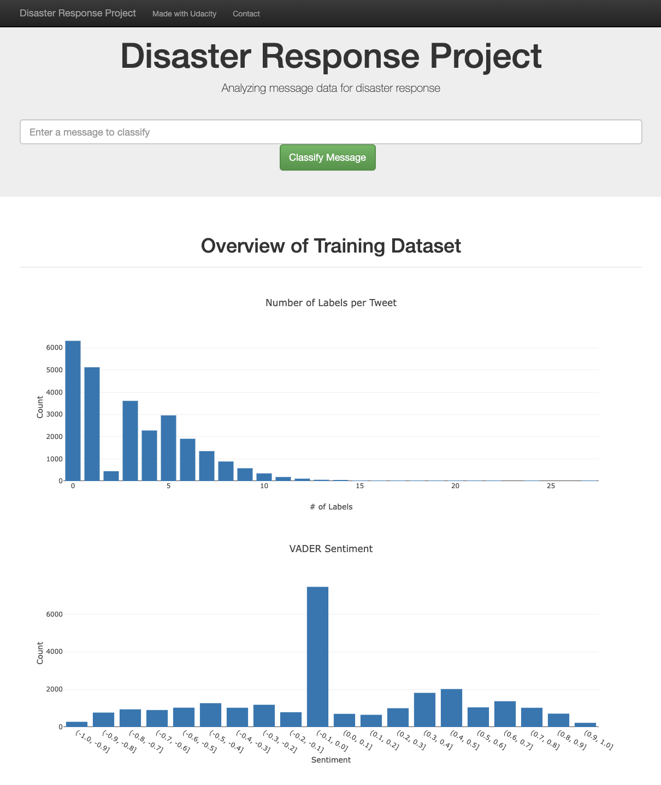

# Disaster Response Pipeline Project

The README file includes a summary of the project, how to run the Python scripts and web app, and an explanation of the files in the repository.

Description

Packages/dependencies

what are the files

### How to Run:
1. Run the following commands in the project's root directory.

    - ETL Pipeline - loads, cleans, and saves data
        `python data/process_data.py data/disaster_messages.csv data/disaster_categories.csv data/DisasterResponse.db`
    - ML Pipeline - build, run, and save model
        `python models/train_classifier.py data/DisasterResponse.db models/classifier.pkl`

2. Run the following command in the `app` directory to run the web app
    `python run.py`

3. Go to http://0.0.0.0:3001/
